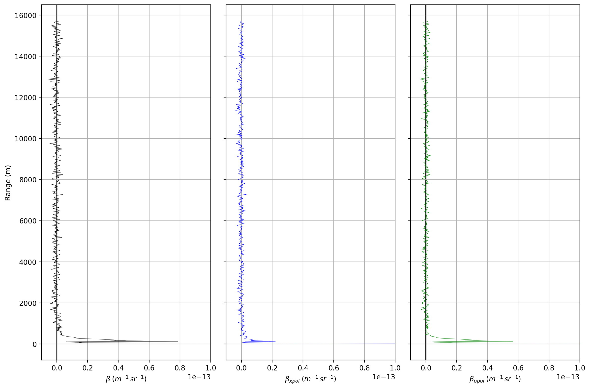

[](https://results.pre-commit.ci/latest/github/RUBclim/ceilometer-toolbox/main)
[](https://github.com/RUBclim/ceilometer-toolbox/actions/workflows/ci.yml)
[](https://github.com/RUBclim/ceilometer-toolbox/actions/workflows/pages.yaml)

# ceilometer-toolbox

This is a unified collection of state-of-the-art tools for processing ceilometer data.
This makes use of the following tools:

1. [raw2l1](https://github.com/ACTRIS-CCRES/raw2l1)
2. [stratfinder](https://gitlab.in2p3.fr/ipsl/sirta/mld/stratfinder/stratfinder)
   (Kotthaus et al. 2020)
3. [stratfinder-qc](https://gitlab.in2p3.fr/ipsl/sirta/mld/stratfinder/qc-sf-python)

It builds a file tree to easily store and access data from multiple sensors, hiding
multi-file and multi-folder complexity and making it easily accessible from python.

Docs: https://rubclim.github.io/ceilometer-toolbox/

## installation

via https

```bash
pip install git+https://github.com/RUBclim/ceilometer-toolbox
```

via ssh

```bash
pip install git+ssh://git@github.com/RUBclim/ceilometer-toolbox
```

## Getting started

1. Locate the root folder where all ceilometer data is stored in. It is important that
   the date matches this format: `{prefix}{file_date:%Y%m%d}_*.nc`. If a custom way of
   deriving raw data between two dates is needed, the `Ceilometer.glob_day_raw_data`
   methods needs to be overridden after inheriting from `Ceilometer`.

   ```
   ├── ceilometer-data
   │   ├── live_20260217_150920.nc
   │   ├── live_20260217_151420.nc
   │   ├── live_20260217_151920.nc
   ...
   ```

1. Create a `CeilometerArchive` instance and point it at a folder where you want to
   store the data.

   ```python
   from ceilometer_toolbox import CeilometerArchive

   archive = CeilometerArchive('ceilometer-output')
   ```

1. Create a `Ceilometer` instance and pass the previously created `archive` to it.

   ```python
   from ceilometer_toolbox import Ceilometer

   ceilometer = Ceilometer(
       device_id='IA',
       input_dir='ceilometer-input',
       archive=archive,
       raw2l1_config_file='example_configs/raw2l1_cl61.conf',
       stratfinder_config_file='example_configs/stratfinder_settings_cl61.json',
       stratfinder_qc_value_config_file='example_configs/values_qc.toml',
       stratfinder_qc_metadata_file='example_configs/STRATFINDER_metadata.toml',
   )
   ```

1. You may provide all config files for the respective tools when creating the instance,
   they will be used for processing in the respective steps, may, however, also be
   overwritten. Please see the respective tool for a full documentation on the
   configuration.

1. Now start processing the raw data to L1:

   ```python
   ceilometer.process_raw_files(start_date='2026-05-06', end_date='2026-05-07', jobs=1)
   ```

   This will run `raw2l1`, reading from the `input_dir` specified. `jobs` can control
   concurrency which will spawn multiple processes running raw2l1 in parallel. Note that
   this is an IO-heavy tasks. Excessively high concurrency may lead to slower
   performance. Especially when the target or source is a mounted network drive.

1. Now run `stratfinder` on the L1 data. This cannot be run in parallel, since it
   depends on files from the previous day, which may not be ready. By default this will
   run stratfinder in docker via the matlab runtime. If you have stratfinder already
   setup locally, you may pass `in_docker=False` and set the `executable_path=...`. Then
   no docker is needed.

   ```python
   ceilometer.process_l1_files(start_date='2026-05-06')

   ```

   For this step you will have to have `docker` installed and the `stratfinder` image
   built. Please see [STRATfinder-docker](https://github.com/RUBclim/STRATfinder-docker)
   for instruction

1. Finally run the quality control on the `stratfinder` output

   ```python
   ceilometer.process_stratfinder_qc(start_date='2026-05-06')
   ```

1. Now a file tree should be present (`device_id` &rarr; `year` &rarr; `month` &rarr;
   `day/file type`):

   ```
   ├── ceilometer-output
   │   └── IA
   │       └── 2026
   │           └── 05
   │               ├── 20260503_L1.nc
   │               ├── 20260503_L2A_beta.nc
   │               ├── 20260503_L2A_stratfinder.nc
   │               └── 20260503_L2B_stratfinder.nc

   ```

## Accessing data

The data is stored in a tree-like structure so filesystem performance remains high and
access to ranges of data is fast. The `CeilometerArchive` instance allows interaction
with the file tree, fully hiding its complexity.

### Reading

Any range of data can be accessed with a context manager like this:

```python
with archive.open_dataset(
    device_id='IA',
    file_type='L2A_stratfinder',
    start_date=datetime(2026, 5, 1),
    end_date=datetime(2026, 5, 3),
) as ds:
    ...
```

This will find and read all files needed to cover the range. This uses `dask` and this
way avoids reading all files into memory at once, hence, long time periods can be loaded
without the need for a lot of RAM.

The archive may be queried for the latest date of a file type e.g. to determine where to
continue processing.

```python
archive.latest_date(
    device_id='IA',
    file_type='L1',
)
```

To e.g. speedup search one can set `from_date` for a start point in time to start
looking backwards for the latest file of the specified type. This may be needed if
historical data should be processed.

You can also retrieve the raw list of files that cover the date ranges specified if you
want to handle them manually using the `get_files` method.

To check if an individual file exists you may use the `get_file_or_none` method.

```python
archive.get_file_or_none(device_id='IA', file_type='L1', file_date=datetime(2026, 5, 1))
```

This will return the full path to the matching file or `None` when the file does not
exist.

### Writing

Adding files to the file tree can be done via `put_file` or `atomic_put_file`.

```python
archive.put_file(
    device_id='IA',
    file_type='L1',
    file_date=datetime(2026, 5, 1),
    override=True
)
```

Since raw2l1 writes values consecutively to the file, this is not atomic. Trying to run
any other call on a partially written file will fail.

To ensure atomic writing use the `atomic_put_file` context manager. Which will first
write to a temporary file and once finished replace/create the final file atomically.
The context manager yields the file name of the temporary path. This may be passed to
the tool as output file.

```python
with archive.atomic_put_file(
    device_id='IA',
    file_type='L1',
    file_date=datetime(2026, 5, 1),
    override=True
) as f:
   ...
```

Files may also be deleted using the `delete` method.

## Plotting data

The toolbox also comes with simple plotting functions for plotting $\beta$ and the
linear depolarization ratio (CL61).

```python
ceilometer.beta_plot(
    start_date=datetime(2026, 4, 28),
    end_date=datetime(2026, 5, 2),
    show_mlh=True,
    show_ablh=True,
    show_cbh=True,
    alt_max=2500,
    output_path='beta_plot.png',
)
```


This automatically applies resampling (nearest) to allow plotting longer time series
This can, however, be changes by passing a different function via `resampler=` e.g.
using averages instead which are computationally much more expensive. The QC-Flags are
automatically taken into account and excluded, unless you set `filter_qc=False`.

The maximum altitude can be set via `alt_max`. The linear depolarization plot has a
similar interface, however, omitting the MLH, ABLH and CBH options.

```python
ceilometer.ldr_plot(
    start_date=datetime(2026, 4, 28),
    end_date=datetime(2026, 5, 2),
    alt_max=2500,
    output_path='ldr_plot.png',
)
```


## Dark measurement profile

Dark measurement profiles can be derived from periods of clear nighttime skys or using
an optical termination hood mimicking full atmospheric attenuation to derive the
internal background noise for $\beta$, $\beta_{xpol}$, and $\beta_{ppol}$. This closely
follows Kotthaus et al. 2016 and Looschelders et al. 2025.

If you already have a profile, you can pass this when creating an instance of the class:

```python
import xarray as xr
from ceilometer_toolbox import Ceilometer
from ceilometer_toolbox import CeilometerArchive

profiles = xr.open_dataset('median_dark_measurement_profile.nc')

archive = CeilometerArchive('ceilometer-output')
ceilometer = Ceilometer(
    device_id='IA',
    input_dir='ceilometer-input',
    archive=archive,
    raw2l1_config_file='example_configs/raw2l1_cl61.conf',
    stratfinder_config_file='example_configs/stratfinder_settings_cl61.json',
    stratfinder_qc_value_config_file='example_configs/values_qc.toml',
    stratfinder_qc_metadata_file='example_configs/STRATFINDER_metadata.toml',
    calibration_profile_beta=profiles['beta_att'],
    # omit those if your ceilometer does not support that
    calibration_profile_p_pol=profiles['p_pol'],
    calibration_profile_x_pol=profiles['x_pol'],
)
```

If you do not have one yet, you can easily create one using the ceilometer instance.
After creation they are automatically assigned to the class. And applied.

```python
profiles = ceilometer.derive_median_dark_measurement_profile(
   # start of the period where the termination hood was put up
   start_date=datetime(2026, 5, 28, 8, 39, 0),
   # discard the first time period and let the instrument settle
   discard_window=timedelta(minutes=20),
   # use the subsequent time period for deriving the median profile
   calibration_window=timedelta(minutes=30),
)
# create a plot from the derived background noise
ceilometer.median_over_range_plot(
   profile=profiles,
   output_path='median_over_range_plot.png',
)
# save the profile to disk for later use
profiles.to_netcdf('median_dark_measurement_profile.nc')
```



### Removal of background noise

When a calibration profile is specified in the class instance, the `.to_l1` and
`.process_raw_files` method will subtract this profile during creation of the L1 data.
This is applied to `rcs_1`, `rcs_2`, and `beta` while `rcs_0` and `ldra` are recomputed
from the adjusted `rcs_1` and `rcs_2` before being saved to the L1 file.

## References

Kotthaus, S., O’Connor, E., Münkel, C., Charlton-Perez, C., Haeffelin, M., Gabey, A. M.,
& Grimmond, C. S. B. (2016). Recommendations for processing atmospheric attenuated
backscatter profilesfrom Vaisala CL31 ceilometers. Atmospheric Measurement Techniques,
9(8), 3769–3791. https://doi.org/10.5194/amt-9-3769-2016

Kotthaus, S., Haeffelin, M., Drouin, M.-A., Dupont, J.-C., Grimmond, S., Haefele, A.,
Hervo, M., Poltera, Y., & Wiegner, M. (2020). Tailored Algorithms for the Detection of
the Atmospheric Boundary Layer Height from Common Automatic Lidars and Ceilometers
(ALC). Remote Sensing, 12(19), 3259. https://doi.org/10.3390/rs12193259

Looschelders, D., Christen, A., Grimmond, S., Kotthaus, S., Fenner, D., Dupont, J.,
Haeffelin, M., & Morrison, W. (2025). Inter‐Instrument Variability of Vaisala CL61
Lidar‐Ceilometer’s Attenuated Backscatter, Cloud Properties and Mixed‐Layer Height.
Meteorological Applications, 32(5), e70088. https://doi.org/10.1002/met.70088
